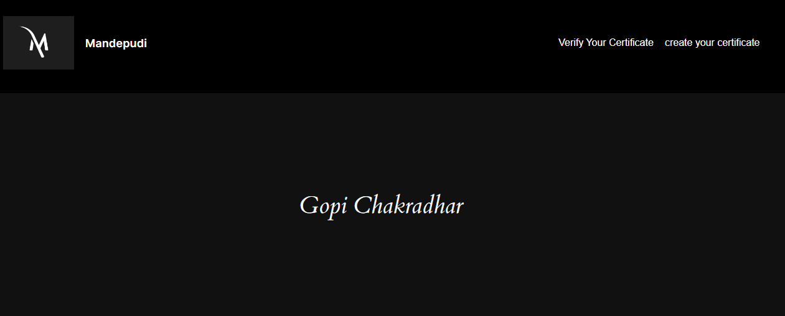
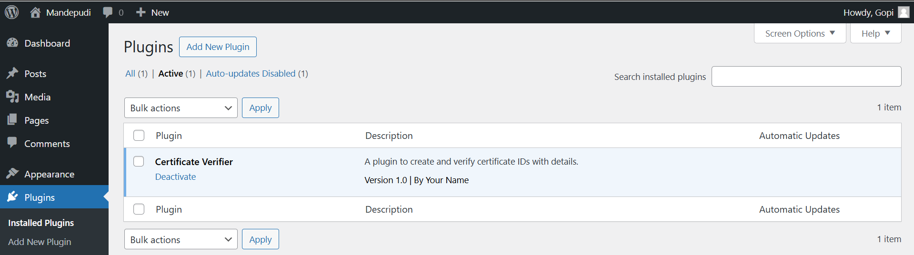
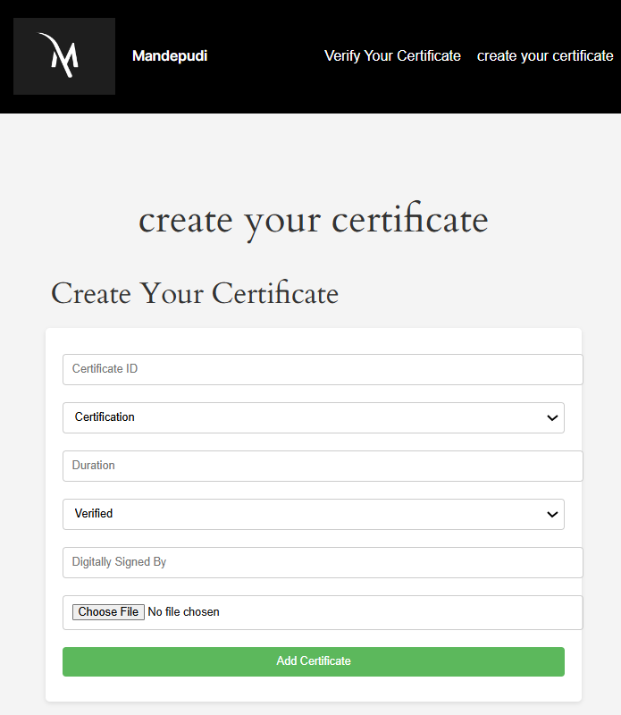
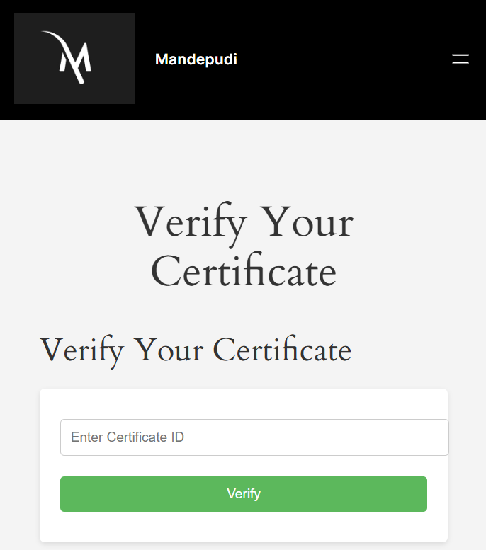

# 🎓 **Certificate Verifier - Secure Certificate Management Plugin**

Welcome to **Certificate Verifier**, a WordPress plugin designed to create and verify certificates effortlessly! This plugin allows organizations to manage their certificate issuance securely, ensuring authenticity and ease of use for both administrators and users. Built with **PHP**, **MySQL**, and the **WordPress** framework, it enhances your site's functionality with a focus on security and user experience. 🚀

## 🌍 **Live Preview**

 
Experience the plugin in action:  
[Certificate Verifier - Live Demo](http://shivacertverify.unaux.com/)

## 📱 **Responsive Views**

Here’s how the plugin interface looks across different devices:
- **Admin Dashboard View**
 
- **Front-End Creation Form**
  
- **Front-End Verification Form**  
  

## ✨ **Features**

- 📜 **Certificate Creation**: Easily create and store certificates with detailed information.
- 🔍 **Certificate Verification**: Allow users to verify the authenticity of certificates using unique IDs.
- 🛠️ **User-Friendly Admin Interface**: Simple navigation for managing certificates.
- 🔒 **Secure Uploads**: Safe file upload for digital signatures.

## 🛠️ **Technologies Used**

- 🟠 **PHP**: The backbone of the plugin's logic and database interactions.
- 🔵 **MySQL**: For efficient data storage and retrieval.
- 🟢 **WordPress API**: Utilized for seamless integration into WordPress sites.
- 🌐 **HTML/CSS**: For responsive and user-friendly forms.

## 🚀 **How It Works**

1. **Admin Dashboard**: Access the admin panel to create and manage certificates.
2.  **Create Certificate**: Fill out the form with certificate details and upload a digital signature.
4. **Verify Certificate**: Users can enter their certificate ID to verify its authenticity.

## 📬 **Contact Me**

Got feedback or questions? Feel free to reach out!  
Visit my portfolio: [Gopi Chakradhar Portfolio](https://mgopiportfolios.netlify.app/)

---

✨ Built with passion and creativity by [Gopi Chakradhar](https://github.com/Gopi1603) ✨
